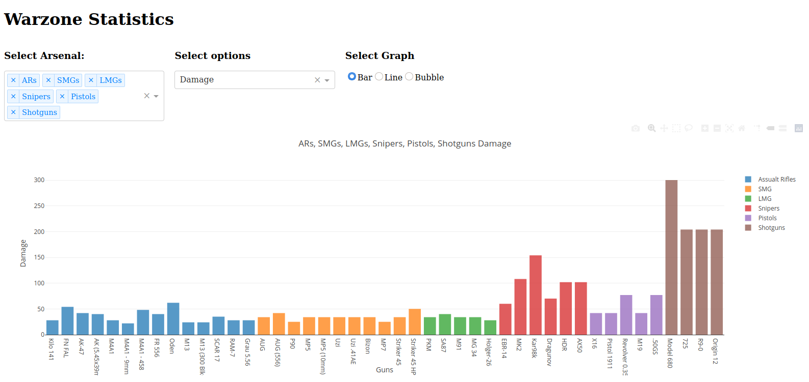

## Call of Duty Plotly Dashboard

A little project I found myself preoccupied with during quarantine plus I guess this really helped me out with my gameplay,soo...  

This is a Python Dashboard displaying COD Modern Warfare arsenal statistics using plotly and dash.

The **Dashboard.py** contains the dash app which uses *flask* to serve the content, the data for the statistics is provided in the **Warzone.xlsx** sheet. This is an app deployed on Heroku, you can [visit the site](https://warzone-dashboard.herokuapp.com/) if it's not asleep. **requirement.txt** contains all the imports required by python to run the app. For details regarding deployment to *Heroku* services please visit their website, it has ton of information and great graphics to learn from. The **notebook** contains the pre-processing information for the Warzone stats sheet the  original of which is the **Warzone DPS.xlsx**. **Proc** and **runtime.txt** are environment setup files for Heroku installation and server setup. The information displayed in this app and on the site is up to date to *Season 3 of Call of Duty Modern Warfare 2019*. The graphs used are bar plot, line plot, bubble plot, box plot and distribution graph. Feel free to add your own.

> Checkout the excel sheet to know data that is being visualized plus here's a screenshot:

